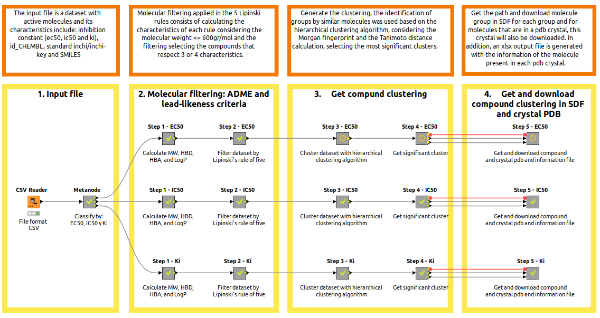
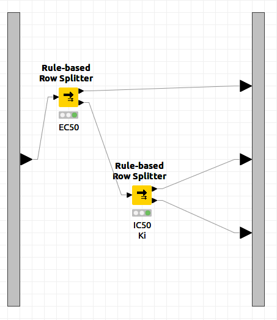
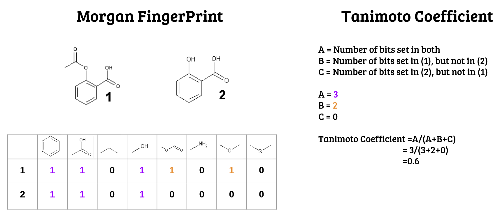
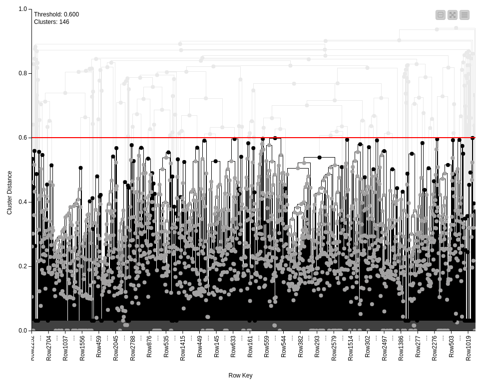

# Search for pharmacophores based on bioactive molecules in key proteins for Alzheimer's disease

Using a workflow implemented with the [Knime](https://www-knime-com.translate.goog/?_x_tr_sl=auto&_x_tr_tl=es&_x_tr_hl=es-419)
 tool (open source software used in data science) and bash code, we started with a dataset of key proteins associated with AD, for each of them we identified the bioactive molecules (EC50, IC50 and Ki) from the database [ChEMBL](https://www.ebi.ac.uk/chembl/). Each set of molecules were filtered according to Lipinski's rules and a similarity matrix was calculated using the Morgan fingerprint and Tanimoto similarity coefficient. Subsequently, they were classified by hierarchical clustering, thus finding clusters of bioactive molecules against each target, but different from each other. Finally, for each cluster, pharmacophore hypotheses were generated with Phase software, selecting the best one with respect to the phasehyposcore, resulting in a set of pharmacophores.

## Requirements
- Knime version 4.6, open source software for data analysis.
- Install rename to run script 2 and 3 in bash "sudo apt install rename", if using conda "conda install -c bioconda rename".
 
This workflow is composed of 2 parts, the first corresponds to a flow with Knime that is subdivided into 4, which can be seen in the figure and the second part corresponds to 3 codes implemented with bash. 

 

 
  #### 1. Input file
The input file is in csv format and presents a dataset with active molecules and in this case its characteristics include: inhibition constant (ec50, ic50 and ki), id_CHEMBL, standard inchi/inchi-key and SMILES.

 

In addition they are separated by each type of inhibition that they present as already mentioned ec50, ic50 and Ki.

 
  
#### 2. Molecular filtering: ADME and lead-likness criteria

The next step is a molecular filtering applying the Lipinski rule of 5 (LogP <=5, molecular weight <=500 gr/mol, hydrogen bond acceptors <= 10 and hydrogen bond donors <=5). In this case, molecular weight <=600 gr/mol is considered and these characteristics are calculated for each of the molecules and the compounds that respect 3 or 4 of the characteristics corresponding to molecular properties that have pharmacokinetic importance in the human body are selected.

##### Step 1: Calculate MW, HBD, HBA, and LogP
With the canonical format obtained from RDKit, the salts that may be present in the molecules are removed and the properties of the Lipinski rules are calculated.

##### Step 2:Filter dataset by Lipinski's rule of five
With the properties obtained from the previous step for each of the molecules, a filter is applied for each property (MW, HBD, HBA, LogP) and a Boolean value is assigned (1 complies and 0 does not comply), then these values are added for each molecule and all molecules with a value of 3 or 4 are selected, thus considering only those molecules that comply with 3 or 4 of the pharmacokinetic characteristics evaluated.

   
#### 3. Get compound clustering
To generate the clusters, we used the identification of groups by similar molecules based on the Morgan fingerprint and the calculation of the Tanimoto distance, and by means of the hierarchical clustering algorithm we selected the most significant clusters with 10 or more molecules.

##### Step 3: Cluster dataset with hierarchical clustering algorithm
The molecules are grouped according to the chemical structural similarity between them and thus find groups that share a common scaffold. These molecules are identified with fingerprints in this case was carried out by Morgan FingerPrint and in the case of similarity can be described by the Tanimoto coefficient, which varies from zero to one, where values close to zero represent a low similarity and values close to 1 a high similarity.

 

Next, the hierarchical clustering algorithm is used to identify groups with similar compounds, thus generating representative clusters. And within the selection of siginficative clusters these must a present 10 or more molecules.

##### Step 4: Get significant cluster 

##### Step 5: Get and download compound and crystal pdb and information file

#### 5. Scripts in bash
##### Script 1: 1_preparate_ligprep.sh
The script has 3 functions, which are: 

- Change the format of the sdf files to mae, and prepare the molecules with Schrodinger's LigPrep at pH 7.4 +/-0.2 and generating at most one ligand.

 - Separate the files into different folders according to the corresponding extension of each one (cluster_mae, cluster_prep, ligprep, pdb, sdf), and also generate two more folders that will be used in the following scripts, pharmacophore (script 2) and hypothesis (script 3).

- Copy and rename the inp and def files with the name corresponding to their directory and cluster, since they are used as input for the elaboration of the pharmacophores.

##### Script 2: 2_create_pharmacophore.sh
The script has 2 functions, which are: 

- To generate the pharmacophore hypotheses for each cluster considering from 3 to 7 features for the hypotheses and generating at most 10 hypotheses for each of these features and finally with a match of 85%.

- From the *.phypo.mae.gz file generated from the previous function, 2 columns are extracted corresponding to the name of the hypothesis and its hyposcore which is the score assigned to the hypothesis, this file is saved after sorting it in descending order leaving first the best hypothesis of the cluster

##### Script 3: 3_seach_hypotheses.sh
The script has 3 functions, which are: 

- It looks for the best hypothesis, taking into account the phasehyposcore, renames it with respect to FolderName_Cluster_Cluster_Cluster_HypothesisFeatures and moves it to a folder where all the best hypotheses of each cluster for the protein under study will be.
